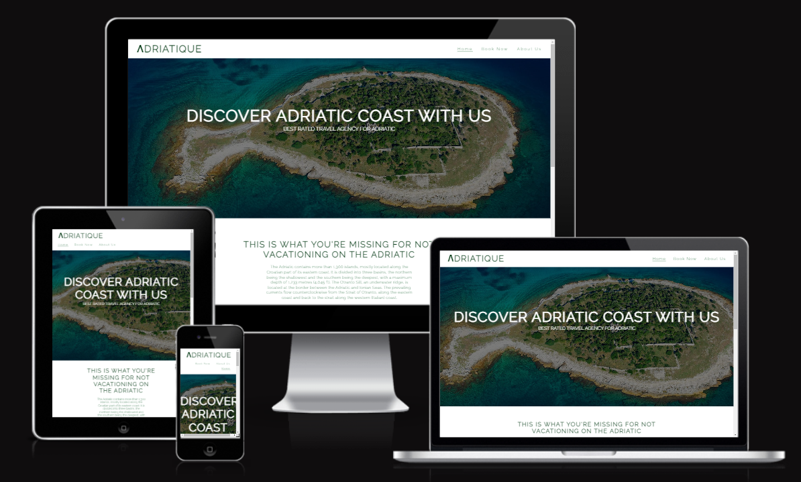
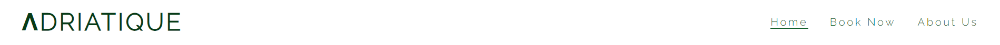

# Ʌdriatique Travel Agency

This website was created as a fictitious travel agency for Adriatic, based in Dublin, Ireland.
The aim of the travel agency is to provide a complete service of travel organization for people of all ages who want to visit the Adriatic.

The website contains a home page with three sections. Book Now page that contains a form that the visitor can fill out if he is interested in choosing his desired trip, and the confirmation page which the user is redirected after filling out and submiting the form. About Us page that contains two sections that tell more about the travel agency itself and our bigger goal in the future.

A live version of the project can be found here - https://ancelottidev.github.io/adriatique/
 
 # Table of Content

+ [Requirements](#requirements "Requirements")
+ [Design](#design "Design")
    + [Typography](#typography "Typography")
    + [Images](#images "Images")
+ [Features](#features "Features")
  + [Existing Features](#existing-features "Existing Features")
    + [Header With Logo and Navigation Bar Section](#header-with-logo-and-navigation-bar-section "Header With Logo and Navigation Bar Section")
    + [Home Page Hero Outer Section](#home-page-hero-outer-section "Home Page Hero Outer Section")
    + [Vacation Section](#vacation-section "Vacation Section")
    + [Destinations Section](#destinations-section "Destinations Section")
    + [Footer Section](#footer-section "Footer Section")
    + [Book Now Image Section](#book-now-image-section "Book Now Image Section")
    + [Book Now Form Section](#book-now-form-section "Book Now Form Section")
    + [About Us Section](#about-us-section "About Us Section")
    + [Our Mission Section](#our-mission-section "Our Mission Section")
    + [Confirmation Section](#confirmation-section "Confirmation Section")
+ [Technologies used](#technologies-used "Technologies used")
+ [Testing](#testing "Testing")
  + [Validator Testing](#validator-testing "Validator Testing")
  + [Unfixed Bugs](#unfixed-bugs "Unfixed Bugs")
+ [Development and Deployment](#development-and-deployment "Development and Deployment")
+ [Content](#content "Content")
+ [Media](#media "Media")
+ [Credits](#credits "Credits")

### Requirements

A static responsive website that incorporates the technologies I have learned so far that contains some advanced functionality. The development process needs to be well documented through a version controls system such as GitHub.

Required technologies: HTML, CSS

### Design

The design for this project came from ”Love Running” project.

My idea for this project was to create a functional and eye-pleasing website for a fictitious travel agency with all my knowledge that I have acquired so far through this course. In my opinion, the design is solid, and I think that in the future I can improve it even more.

#### Typography

The [Google Font Raleway](https://fonts.googleapis.com/css2?family=Raleway:wght@300&display=swap) was chosen as the main font with a fallback of Sans-Serif. Font weight of 300 have been used on the website.

#### Images

The images are selected according to the criterion that they match the text and context. Pictures taken exclusively from the specific place/country to which the context refers.

## Features 

Ʌdriatique Travel Agency website is a three-page website plus a Confirmation Page that consists of the following sections:

 - Header (Logo/Navigation Bar)
 - Home Page Hero Outer Section
 - Vacation Section
 - Destination Section
 - Footer
 - Book Now Image Section
 - Book Now Form Section
 - About Us Section
 - Our Mission Section
 - Confirmation Section

 ### Existing Features

 #### Header With Logo and Navigation Bar Section

  - The Header consists of a Logo section that is aligned to the left and a Menu that is aligned to the right.
  - Featured on all four pages, the navigation bar includes links to the Home page, Book Now page and About Us page and is identical in each page to allow for easy navigation.

  